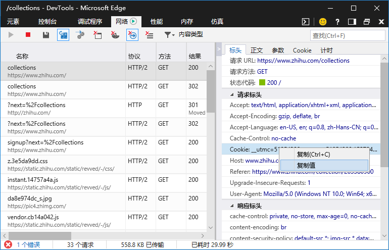
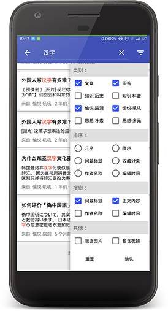
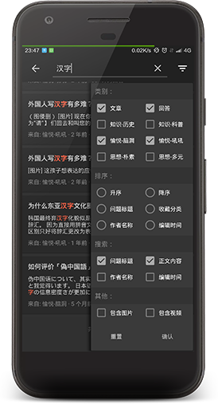

# zhihu-fav
## scrape.py
### 基本功能
* 爬虫基于Python 3.6，使用SQLite存储，数据包括收藏夹、作者、编辑时间、链接、问题和回答
* 每个收藏夹按页爬取，可选择只要上次爬取之后新收藏的，还可选爬完收藏夹后顺便下载答主头像
* 以单线程爬取网页，两次请求之间间隔1-2s，已测试不下载答主头像的情况下连续爬1200条收藏
* 数据库可以输出为sql脚本，以便导入到安卓客户端中使用
### 使用说明
* 登录后使用可防止遗漏游客身份不能查看的问题或文章，爬私密收藏夹也需要登录信息
* 自动爬取多个收藏夹只支持登录后从 https://www.zhihu.com/collections 及类似页面开始
* 当然也可以手动设需要爬取的收藏夹链接，按照scrape.py最后的Run Script部分代码里的注释操作即可
* 若要用登录信息，需先在浏览器登录，然后找到scrape.py最后的Run Script部分，把Cookie粘贴到header处再运行脚本
* 登录Cookie获取：在收藏夹页面打开F12-网络，刷新，点击url和地址栏相同的那项html，复制右侧请求标头里的Cookie值  

## FavViewer
### 基本功能
* 可对爬取的收藏夹数据进行搜索，支持搜索标题、正文、作者、时间，支持按文章/回答、收藏夹筛选
* 回答中的图片可以进行本地缓存，且在使用流量时不会自动下载
* 支持夜间模式，默认支持安卓4.4及以上系统
### 使用说明
* 打开前要把scrape.py导出的sql脚本放到：外部存储(如SD卡)/Android/data/com.toolkit.zhihufav/files/fav.sql
* 在回答正文页点击标题可以查找同问题下收藏的其他回答；双击标题则查找已收藏的该答主其他回答
### 屏幕截图
* 示例收藏内容分别来自（求生欲很强）：  
https://www.zhihu.com/question/28891984/answer/49423495  
https://www.zhihu.com/question/28891984/answer/49989294  
https://www.zhihu.com/question/29896218/answer/157398073  
https://www.zhihu.com/question/40522110/answer/269795931    
 
